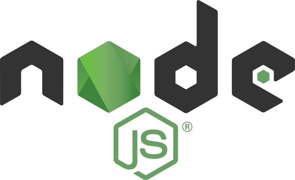

<p align="center"></p>

# Node.js Starter

Simple Node.js Starter with Express.js and Prisma.

## Run Locally

Clone the project

```bash
  git clone https://github.com/ahmdswerky/node-starter
```

Go to the project directory

```bash
  cd node-starter
```

Start the server with yarn

```bash
  yarn start
```

Or with npm

```bash
npm start
```

## Authors

- [@ahmdswerky](https://github.com/ahmdswerky)

## License

[MIT](LICENSE.md)
